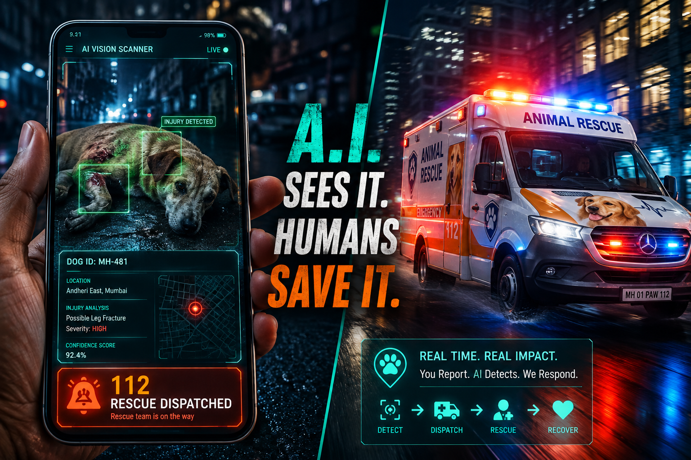

# 🐾 PawID & Care

<p align="center">
  
</p>

An enterprise-grade civic-tech platform for AI-powered dog identification, real-time device geolocation triage, emergency rescue dispatching, and community animal healthcare management.

**📹 Demo Video:** [https://youtu.be/_B-2dL2fDX4](https://youtu.be/_B-2dL2fDX4)

---

## 📌 Project Overview & Core Agenda

**PawID & Care** bridges the gap between stray dog welfare, municipal public health, pet identification, and 112-style emergency rescue routing. Powered by multimodal Google Gemini vision analysis, real-time browser geolocation capture, interactive voice calling gateways, Solana blockchain ledger anchoring, and Snowflake data warehousing, PawID & Care provides instant biometric identification, emergency triage, and dynamic dispatching.


### 🏛️ The 4 Core Pillars

1. 🧠 **Biometric AI Triage (Google Gemini 3.7 Flash Engine)**
   - Performs canine visual recognition and biometric profile matching.
   - Evaluates coat signatures, distinctive marks, trauma, and urgency levels (LOW / MEDIUM / HIGH).
   - Enforces immediate rejection guardrails for non-dog image uploads.

2. 📞 **Smart Multi-Tier Emergency Routing & Voice Call Cascading**
   - **Case A (Known Dog - Injured):** Places outbound voice calls directly to registered pet owners. If unconfirmed, allows interactive 112 rescue escalation.
   - **Case B1 (Unknown Stray - Injured):** Automatically triggers high-urgency 112 hotline dispatches to nearest rescue NGOs.
   - **Case B2 (Unknown Stray - Healthy / Unimmunized):** Dispatches alerts to community vet clinics for rabies immunization drives.

3. 🔐 **Role-Based Access Control (RBAC)**
   - **Public Citizen:** Scan dogs, capture real-time device geolocation, report strays/pets, and trigger emergency triage.
   - **Pet Owner:** Manage registered pet profiles, update emergency contact numbers, and monitor incoming triage alerts.
   - **Rescuer NGO:** View emergency dispatches with dynamic GPS scan locations, update ticket statuses (`EN_ROUTE`, `RESOLVED`), and upload proof of rescue.
   - **Vet Clinic:** Track unimmunized stray populations, monitor community herd immunity metrics, and administer vaccination records.

4. ⛓️ **Immutable Ledger & Cloud Analytics (Solana & Snowflake)**
   - Anchors scan records and vaccination status hashes on **Solana Devnet**.
   - Streams scan telemetry into **Snowflake Data Warehouse** to compute real-time herd immunity scores and municipal public health metrics.

---

## ⚡ Prerequisites & `.env` Configuration

### Prerequisites
- **Node.js**: v18.0.0 or higher
- **npm**: v9.0.0 or higher

### Environment Variables (`.env`)
Create a `.env` file in the root directory of the project with the following configuration:

```env
# Server Port
PORT=3000

# Google AI Gemini API Key
GOOGLE_AI_API_KEY=your_google_ai_api_key_here

# Target Phone Numbers (Must include country code, e.g. +91...)
DEFAULT_PHONE=ENTER_YOUR_NUMBER_WITH_COUNTRY_CODE
DEFAULT_RESCUER_PHONE=ENTER_YOUR_NUMBER_WITH_COUNTRY_CODE
DEFAULT_VET_PHONE=ENTER_YOUR_NUMBER_WITH_COUNTRY_CODE
DEMO_TARGET_PHONE=ENTER_YOUR_NUMBER_WITH_COUNTRY_CODE

# AI Voice Gateway Integration (Vapi.ai / Retell / ElevenLabs)
VOICE_GATEWAY_URL=https://api.vapi.ai/call/phone
VAPI_API_KEY=your_vapi_api_key_here
ELEVENLABS_API_KEY=your_elevenlabs_api_key_here
RETELL_API_KEY=your_retell_api_key_here

# Solana Network Configuration
SOLANA_NETWORK=devnet

# Snowflake Data Warehouse Credentials
SNOWFLAKE_ACCOUNT=your_snowflake_account_identifier
SNOWFLAKE_USERNAME=your_snowflake_username
SNOWFLAKE_PASSWORD=your_snowflake_password
SNOWFLAKE_WAREHOUSE=COMPUTE_WH
SNOWFLAKE_DATABASE=PAWID_DB
SNOWFLAKE_SCHEMA=PUBLIC
```

---

## ❄️ Snowflake Database Setup SQL

Execute the following SQL queries in your Snowflake console to initialize the analytics schema and tracking table:

```sql
-- 1. Create Database and Schema
CREATE DATABASE IF NOT EXISTS PAWID_DB;
USE DATABASE PAWID_DB;

CREATE SCHEMA IF NOT EXISTS PUBLIC;
USE SCHEMA PUBLIC;

-- 2. Create Compute Warehouse
CREATE WAREHOUSE IF NOT EXISTS COMPUTE_WH 
  WITH WAREHOUSE_SIZE = 'XSMALL' 
  AUTO_SUSPEND = 300 
  AUTO_RESUME = TRUE;

-- 3. Create Dog Scans Telemetry Table
CREATE TABLE IF NOT EXISTS dog_scans (
    scan_id STRING DEFAULT UUID_STRING(),
    dog_id VARCHAR(50) NOT NULL,
    scan_type VARCHAR(50) NOT NULL,
    vaccination_status VARCHAR(100),
    timestamp TIMESTAMP_LTZ DEFAULT CURRENT_TIMESTAMP()
);
```

---

## 🎙️ Real AI Voice Call Configuration

During live demonstrations, **PawID & Care** triggers outbound AI voice calls to alert owners, rescue teams, or clinics when an emergency scan occurs.

To ensure voice calls reach real target devices during testing:

1. **Country Code Format**: Ensure all phone numbers in `.env` (`DEMO_TARGET_PHONE`, `DEFAULT_RESCUER_PHONE`, `DEFAULT_VET_PHONE`) begin with standard international country codes (e.g. `+91987654321` for India or `+1...` for US/Canada).
2. **Registry Configuration**: Verify that target phone numbers in mock registries (`data/dog_registry.json`, `data/rescuers.json`, `data/vets.json`) include valid country codes.
3. **Demo Override**: Setting `DEMO_TARGET_PHONE` in `.env` automatically routes all automated emergency outbound calls to your specified test handset during live presentations.

---

## 🚀 Getting Started & Running Instructions

### 1. Install Dependencies
```bash
npm install
```

### 2. Start the Server
```bash
npm start
```
*Alternatively, run `node server.js` directly.*

### 3. Launch Web Application
Open your web browser and navigate to:
```
http://localhost:3000
```


